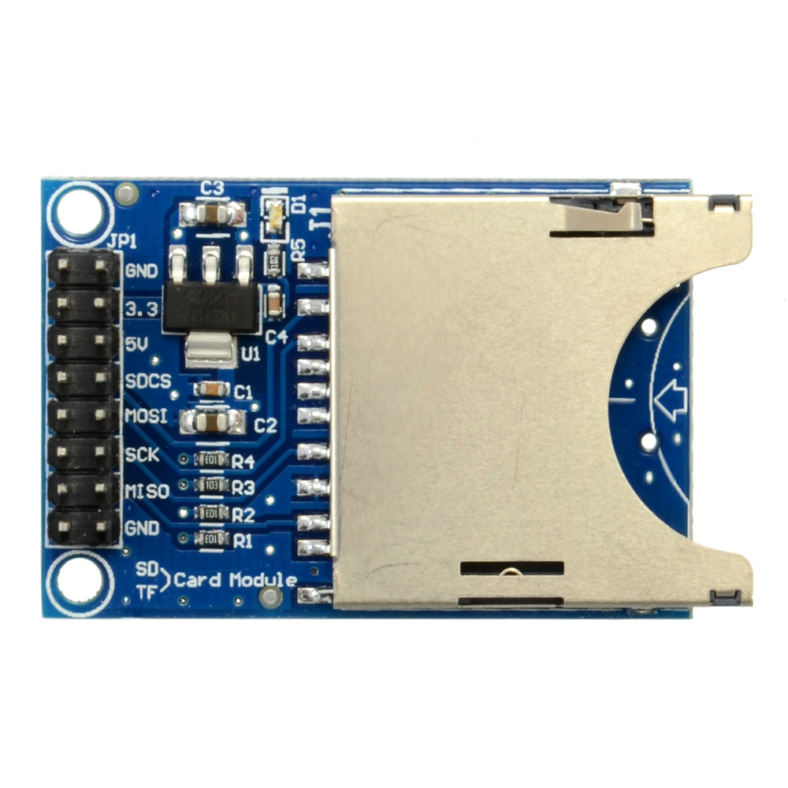

# PCM Recorder - ESP32 #

This document contains the basic documentation for the Espressif ESP32-based PCM Recorder project. It entails an ESP32 microcontroller, an SD card for storage and I2S microphone for recording audio.

## Hardware Platform ##

Assembling the hardware for the firmware contained in this project requires the following:

- ESP32 MCU (WROOM-32 module or similar, no PSRAM required)
- INMP441 MEMS microphone (or compatible)
- SD Card adapter with SPI pin-out:



**I2S Wiring**

The INMP441 microphone is connected to the MCU's GPIO pins with the three I2S lines as follows:

| I2S | GPIO | Description
| --- | --- | ---
| SCLK | 26 | Clock line, also known as bit clock.
| WS | 25 | Word Select, also known as left/right clock.
| DATA | 27 | Data line, also marked as 'SD'.

Other pins on the INMP441 module are connected as follows:

| Pin | Description 
| --- | ---
| Vdd | 3.3 VDC power supply input.
| GND | Ground.
| L/R | Left/Right channel. Connect to ground for left.

**SPI Wiring**

The correct type of SPI mode SD card adapter for use with the ESP32 allows for 3.3 V operation, and may feature a '5V' input pin that connects to a 3.3V voltage regular.

The SPI connection with the ESP32 looks as follows:

| SPI | GPIO | Description
| --- | --- | ---
| SCLK | 18 | SPI clock.
| MISO | 19 | 
| MOSI | 23 | 
| CS | 5 |

The remaining pins are:

| Pin | Description 
| --- | ---
| 3.3 | 3.3 VDC power supply input. Don't use if 5V is used.
| 5V | 5 VDC power supply input. Don't use if 3.3 is used.
| GND | Often presence twice. Connect to ground.

## Building Firmware ##

The firmware is an [ESP-IDF](https://docs.espressif.com/projects/esp-idf/en/stable/esp32/get-started/#manual-installation) project. After following the installation instructions, an ESP-IDF shell is opened. Navigate to the folder where this project was cloned to on the local hard drive and execute the following commands:

```
mkdir build
cd build
cmake .. -G "Ninja"
ninja
```

This creates a new folder called `build` and navigates into it. The cmake command uses the `CMakeLists.txt` file in the folder above it to generate build files for the Ninja tool. With the `ninja` command this tool is executed and it will build the project.

After this command completes the firmware can be flashed onto the ESP32. Assuming an ESP32 development board with onboard serial adapter and USB port is used, the board should be connected via USB to the PC after which executing the command `ninja flash` should automatically find the board and flash the image to it.

## Using The Recorder ##

The PCM recorder firmware will boot as soon as power is connected to the system. It will then wait until a button is pressed to start recording.

By default this is the `Boot` button on a development board, which is connected to GPIO 0. An external momentary button can also be connected to GPIO 4. 

Upon pressing the button the recording task will start, which will read audio samples from the microphone and write these as raw PCM data (signed 32-bit, little endian) to an inserted SD card.

> [!IMPORTANT]
> Currently the SD card is not checked for available free space before or during recording. Please make sure there is enough space available before starting a recording.

Recording is stopped by pressing the button again. The recording state is indicated by GPIO 2 being set to HIGH when a recording is active. On many development boards this GPIO pin is connected to an onboard LED which will thus light up while a recording is active.

> [!WARNING]
> Always stop an active recording before removing power from the microcontroller, as otherwise the SD card's filesystem risks being corrupted.

